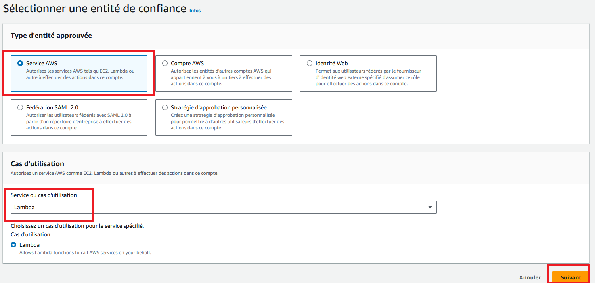
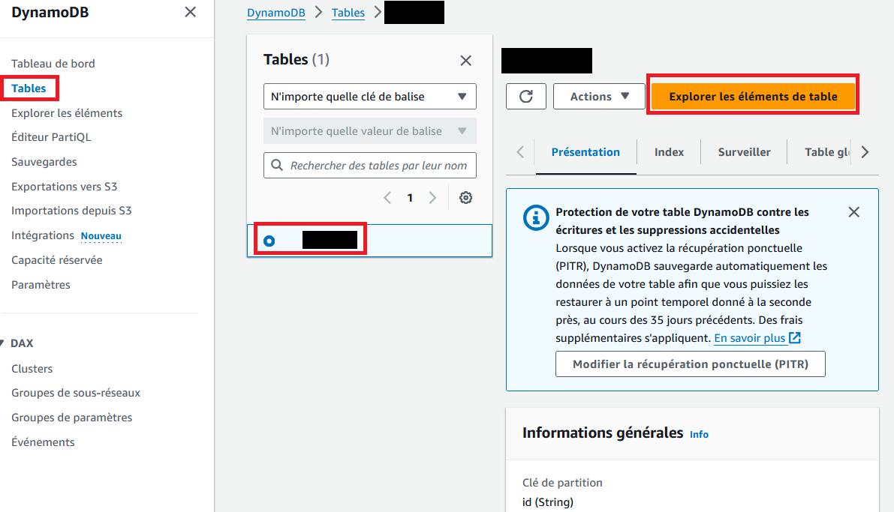
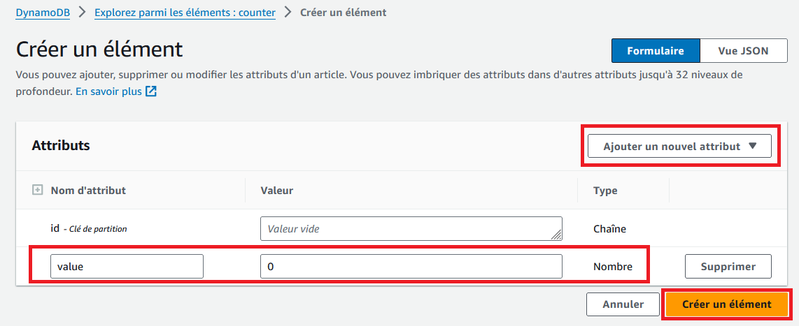

# serverless_lab
Create a website visit counter using Lambda, API Gateway and DynamoDB


### Create Policy

* Edit a policy to enable your Lambda function to perform DynamoDB actions and CloudWatch logs actions.
```
{
  "Version": "2012-10-17",
  "Statement": [
    {
      "Sid": "Stmt1",
      "Action": [
        "dynamodb:DeleteItem",
        "dynamodb:GetItem",
        "dynamodb:PutItem",
        "dynamodb:Query",
        "dynamodb:Scan",
        "dynamodb:UpdateItem"
      ],
      "Effect": "Allow",
      "Resource": "*"
    },
    {
      "Sid": "Stmt2",
      "Resource": "*",
      "Action": [
        "logs:CreateLogGroup",
        "logs:CreateLogStream",
        "logs:PutLogEvents"
      ],
      "Effect": "Allow"
    }
  ]
}
```

### Create role

* Create a role to enable the Lambda function to perform actions on DynamoDB tables.
* Ensure the Lambda service is a trusted identity of this role

* Attach the previously created policy to this role

* Name and create the role


### Create a DynamoDB table

* Create the table

* Name your table and use "id" as the key partition for your table

* Add an element in the table, that will be your counter



### Create Lambda function 

This function will be used to get and update the items from the DynamoDB table.
Create a layer to use the requests module in Python:
```
mkdir python
pip install -t python requests
zip -r9 python_requests_layer.zip python

```
* Upload the zip file to create a new layer and copy its arn


* Create the function 
	Add the uploaded layer to the function
	
	


	Attach the previously created role to the function
* Edit the function code


```
import json
import boto3
import requests
from decimal import Decimal


client = boto3.client('dynamodb')
dynamodb = boto3.resource("dynamodb")
table = dynamodb.Table('counter')
tableName = 'counter'


def lambda_handler(event, context):
    print("event:" + str(event))
    body = {}
    value = 0
    counter_id = 0
    statusCode = 200
    headers = {
        "Content-Type": "application/json"
    }

    try:
        if event['routeKey'] == "GET /counters/{id}":
            body = table.get_item(
                Key={'id': event['pathParameters']['id']})
            print("body:" + str(body))
            body = body['Item']
            body["counter_value"] = int(body["counter_value"]) + 1
            value = body["counter_value"]
            counter_id = body["id"]
            # trigger request to UPDATE the number of visits
            req = requests.put(
                'https://<api_endpoint>/counters/'+str(body["counter_value"]),
                headers={'Accept': 'application/json'})
            
        if event['routeKey'] == "PUT /counters/{id}":
            response = table.update_item(
                Key={"id": str(counter_id)},
                UpdateExpression="set counter_value = counter_value + :val",
                ExpressionAttributeValues={":val": Decimal(str("1"))},
                )
            print("response:" + str(response))
            body = response
    except KeyError as e:
        print(e)
        statusCode = 400
        body = 'Unsupported route: ' + event['routeKey']
    body = json.dumps(body)
    res = {
        "statusCode": statusCode,
        "headers": {
            "Content-Type": "application/json"
        },
        "body": body
    }
    return res
```

### Create the API

* Create an API

* Choose the HTTP API


* The routes will be configured later
* Choose the automated deployment and create the API
* We can now create the routes for the GET and PUT methods


* Create integrations to connect routes and backend resources:
	- Select Lambda as integration type
	
	- Pick your previous Lambda function as integration target
	
	- Repeat the process for all your routes by joining this newly created integration
* Get the URL to invoke your API and test it using the curl command


